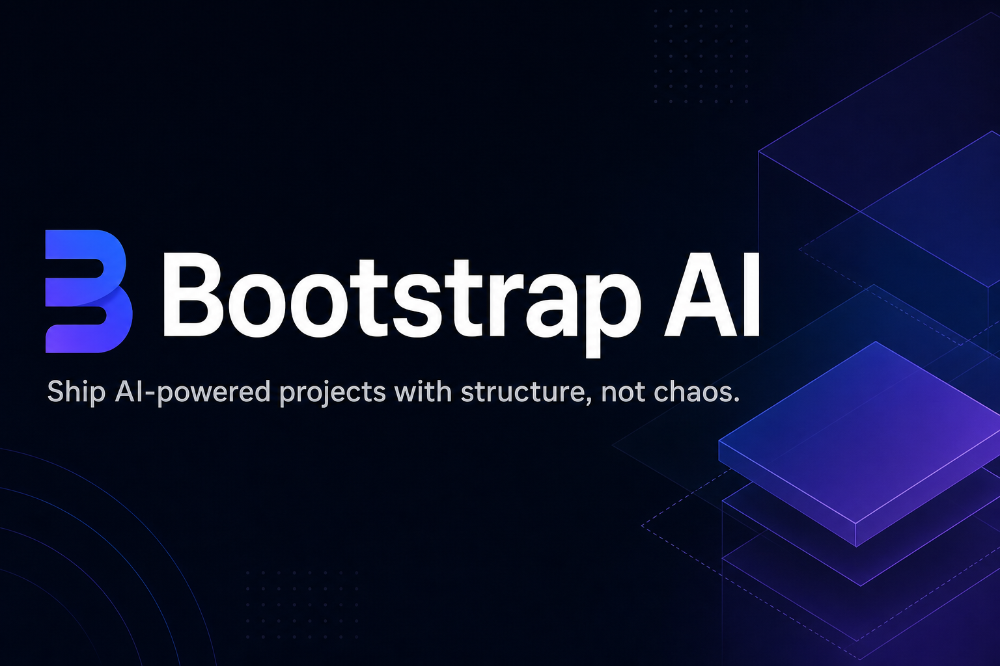
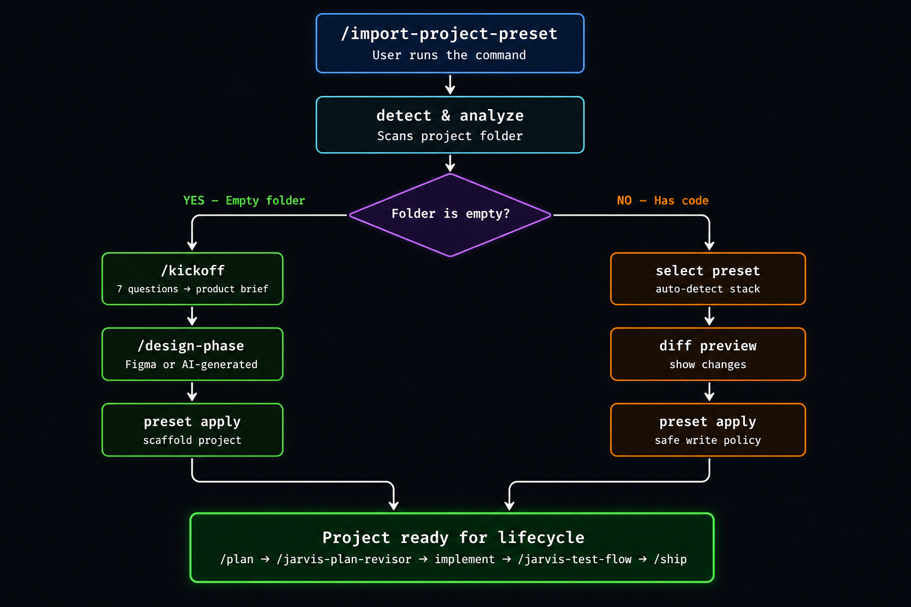

<div align="center">



# Bootstrap AI

**Entregue projetos com IA usando estrutura, não caos.**

[](https://github.com/marcelsanches2/bootstrap-ai/stargazers)
[](./LICENSE)
[](./presets)
[](./bin/bootstrap-ai)

*CLI + sistema de presets que transforma pastas vazias em projetos prontos para produção — e traz estrutura para projetos existentes. Feito para [Claude Code](https://docs.anthropic.com/en/docs/claude-code) e [Hermes Agent](https://hermes-agent.nousresearch.com).*

</div>

---

## O que é?

Bootstrap AI dá ao seu assistente de IA um cérebro específico por projeto. Em vez de começar toda sessão do zero, você aplica um **preset** — um conjunto curado de comandos, configurações, documentação e hooks — que diz ao seu assistente exatamente como o projeto é estruturado, quais convenções seguir e quais workflows enforce.

**Presets são no formato [Claude Code](https://docs.anthropic.com/en/docs/claude-code)** — instalam em `.claude/commands/` e `.claude/settings.json`.


---

## Setup

Instale o comando `/import-project-preset` no seu projeto:

```bash
# Clone o Bootstrap AI (uma vez)
git clone https://github.com/marcelsanches2/bootstrap-ai.git /tmp/bootstrap-ai
cd /tmp/bootstrap-ai

# Instale o importer no seu projeto
./bin/bootstrap-ai install-importer /caminho/do/seu/projeto
```

Isso cria `.claude/commands/import-project-preset.md` no seu projeto. Depois execute dentro do Claude Code:

```
/import-project-preset
```

O comando detecta sua stack, seleciona o preset mais adequado e aplica com política de escrita segura — nenhum arquivo é sobrescrito.

---

## Como o importer funciona



Quando você roda `/import-project-preset`, o sistema:

1. **Detecta** sua stack escaneando arquivos assinatura (`pubspec.yaml`, `package.json`, `pyproject.toml`, etc.)
2. **Analisa** bibliotecas estruturais (Riverpod, TanStack Query, Prisma, SQLAlchemy, etc.)
3. **Direciona** baseado no estado da pasta:
   - **Pasta vazia** → redireciona para `/kickoff` (7 perguntas → product brief → seleção de stack → `/design-phase` → apply do preset)
   - **Tem código** → auto-seleciona o preset correspondente → mostra preview do diff → aplica com política de escrita segura
4. **Sincroniza Design System** — se o projeto já tem tokens de cor, tipografia ou espaçamento, o `DESIGN_SYSTEM.md` é reescrito com a identidade real do projeto em vez do template genérico
5. **Resultado** — projeto scaffolded e pronto para o ciclo de desenvolvimento

---

## Quick Start — Projeto Novo

Começando de uma pasta vazia? Bootstrap AI te guia por um fluxo completo de greenfield: defina o produto, escolha a stack, gere um design system e aplique o preset correto.

```bash
mkdir meu-projeto && cd meu-projeto
git init
```

Depois, dentro do Claude Code ou Hermes Agent, execute:

```
/import-project-preset
```

Bootstrap AI detecta a pasta vazia e te redireciona para `/kickoff`, que passa por:

1. **7 perguntas** sobre seu produto → gera `PRODUCT_BRIEF.md`
2. **Seleção de stack** → escolha entre os presets suportados
3. **`/design-phase`** → extraia de um link Figma Make ou gere um design system via IA
4. **Apply do preset** → projeto scaffolded e pronto

Agora você está no loop de lifecycle:

```
/plan → /jarvis-plan-revisor → implementar → /jarvis-test-flow → /ship
```

---

## Quick Start — Projeto Existente

Já tem um codebase? Bootstrap AI detecta sua stack e aplica um preset sem destruir nada.

```
/import-project-preset
```

Só isso. O CLI:

1. **Detecta** sua stack via regras do `manifest.yaml`
2. **Analisa** bibliotecas estruturais (Riverpod, TanStack Query, Prisma, etc.)
3. **Seleciona** o preset mais adequado
4. **Aplica** arquivos usando política de escrita segura (veja abaixo)

Nenhum arquivo é sobrescrito. Se um arquivo difere do preset, uma cópia `.kit-new` é criada para você revisar.

---

## Presets

| Preset | Stack | Descrição |
|--------|-------|-----------|
| `flutter-app` | Flutter / Dart | App mobile com gerenciamento de estado, rotas e convenções de teste |
| `react-web` | React / TypeScript / Vite | SPA frontend com arquitetura de componentes e integração de design system |
| `node-backend` | Node / TypeScript / Express | API REST backend com padrões de middleware, validação e tratamento de erros |
| `python-backend` | Python / FastAPI | API async backend com injeção de dependência, schemas e testes |

Cada preset instala:

```
CLAUDE.md                      # Contexto do projeto & instruções para IA
.claude/settings.json          # Configuração do Claude Code
.claude/commands/*             # Slash commands para workflows
docs/ai/*                      # Documentação de workflows com IA
plans/.gitkeep                 # Diretório de tracking de planos
.bootstrap-ai.lock             # Lockfile do preset aplicado
```

Variáveis de template como `{{PROJECT_NAME}}` são substituídas automaticamente durante o apply.

---

## Comandos & Skills

### Workflow de Lifecycle

O loop de desenvolvimento principal — execute em sequência:

| Comando | Finalidade |
|---------|------------|
| `/plan` | Gera um plano de implementação para a tarefa atual |
| `/jarvis-plan-revisor` | Revisa e melhora o plano antes da implementação |
| *(implementar)* | Codifica seguindo o plano usando edição normal do Claude Code |
| `/jarvis-test-flow` | Executa a suite de testes completa e corrige falhas |
| `/ship` | Finaliza: revisa, committa e faz push |

### Comandos Manuais

| Comando | Finalidade |
|---------|------------|
| `/jarvis-revisor` | Revisa qualidade do código e sugere melhorias |
| `/jarvis-full-test` | Executa suite de testes completa fora do lifecycle |
| `/refactor` | Workflow estruturado de refatoração |
| `/import-project-preset` | Detecta stack e aplica ou cria um preset |
| `/kickoff` | Fluxo greenfield: 7 perguntas → product brief → seleção de stack |
| `/design-phase` | Geração de design system (import Figma ou gerado por IA) |

### Hooks (Automáticos)

Hooks rodam em pontos específicos durante sua sessão de IA sem invocação manual:

| Hook | Trigger | Comportamento |
|------|---------|---------------|
| `PostToolUse` | Após qualquer tool call | Executa checks de lint |
| `ExitPlanMode` | Ao sair do modo de plano | Auto-dispara `/jarvis-plan-revisor` |
| `Stop` | Quando o agent para | Auto-dispara `/jarvis-test-flow` |

---

## Referência do CLI

O CLI `bin/bootstrap-ai` dá acesso direto a todas as operações:

```bash
# Detecta a stack do projeto
bin/bootstrap-ai detect

# Analisa bibliotecas estruturais e padrões
bin/bootstrap-ai analyze

# Seleciona o preset mais adequado
bin/bootstrap-ai select

# Preview das mudanças sem aplicar
bin/bootstrap-ai diff

# Aplica um preset ao projeto atual
bin/bootstrap-ai apply

# Valida um preset aplicado
bin/bootstrap-ai validate

# Cria um novo preset a partir de uma descrição
bin/bootstrap-ai create <nome> --from "descrição"

# Instala o comando /import-project-preset globalmente
bin/bootstrap-ai install-importer
```

### Criando Presets Customizados

Crie seu próprio preset do zero usando o skill-creator:

```bash
bin/bootstrap-ai create meu-preset --from "App SvelteKit com Tailwind CSS e Drizzle ORM"
```

Isso gera um novo diretório de preset com todos os arquivos necessários, pronto para customizar e aplicar.

---

## Como Funciona

### Detecção de Stack

Cada preset inclui um `manifest.yaml` com regras de detecção:

```yaml
detects:
  any: ["pubspec.yaml"]           # Qualquer um destes arquivos → match
  contains:
    pubspec.yaml: "flutter"       # Arquivo deve conter esta string
  prefer_if: ["lib/main.dart"]   # Boost de confiança se existirem
```

O CLI pontua cada preset contra seu projeto e seleciona o melhor match.

### Detecção de Bibliotecas Estruturais

O comando `analyze` vai mais fundo — detecta bibliotecas e padrões que afetam a estrutura do projeto:

- **Flutter**: Riverpod, BLoC, GetX
- **React**: TanStack Query, Zustand, React Router
- **Node**: Prisma, TypeORM, Mongoose
- **Python**: SQLAlchemy, Alembic, Pydantic

Esta análise alimenta quais comandos e convenções o preset habilita.

### Política de Escrita

Ao aplicar um preset, Bootstrap AI nunca sobrescreve seu trabalho:

| Condição | Ação |
|----------|------|
| Arquivo não existe | Cria |
| Arquivo idêntico ao preset | Skip (no-op) |
| Arquivo difere do preset | Cria cópia `.kit-new` para revisão |

Isso torna seguro reaplicar presets ou atualizar para versões mais recentes.

---

## Contribuindo

Contribuições são bem-vindas. Para adicionar um novo preset ou melhorar um existente:

1. Faça fork do repositório
2. Crie uma branch de feature (`git checkout -b feature/meu-preset`)
3. Construa seu preset usando `bin/bootstrap-ai create <nome> --from "descrição"` ou manualmente
4. Teste com `bin/bootstrap-ai validate`
5. Abra um pull request

Certifique-se que os presets incluem:
- Um `manifest.yaml` completo com regras de detecção
- Todos os arquivos necessários (`CLAUDE.md`, `.claude/settings.json`, commands, docs)
- Variáveis de template onde apropriado (`{{PROJECT_NAME}}`)

---

## Licença

Este projeto está licenciado sob a [Licença AGPLv3](./LICENSE).

---

<div align="center">

**[⬆ Dê uma star neste repo](https://github.com/marcelsanches2/bootstrap-ai/stargazers)** se achou útil.

Feito para o workflow de desenvolvimento assistido por IA. Não é um framework — é uma fundação.

</div>
